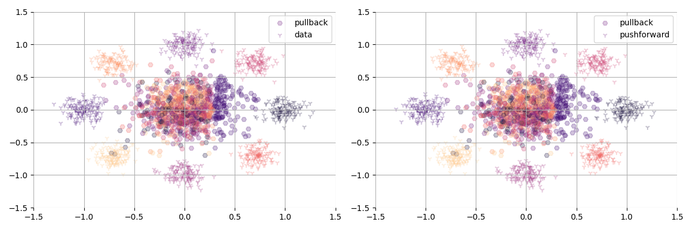

# Block neural autoregressive flows

[](http://www.repostatus.org/#concept)
[](https://github.com/dirmeier/block-neural-autoregressive-flow/actions/workflows/ci.yaml)

> A BNAF implementation in Flax

## About

This repository implements a [block neural autoregressive flow](https://arxiv.org/abs/1904.04676)
using JAX and Flax.

## Example usage

The `experiments` folder contains a use case where we try to model the density of the "Eight Gaussians"
data set. We use the block neural autoregressive flow (BNAF) to compute the inverse, i.e., to compute
the pullback  to the base distribution. Since the forward map, i.e., the pushforward, cannot be
computed analytically, we need to refer to a numerical approach. We could use a simple bisection,
but it is computationally easier to just amortize it by fitting a neural network (MLP).

To fit the BNAF and train an amortized inverter, call:

```bash
cd experiments/eight_gaussians
python main.py --workdir=<dir>
```

The figures below shows training data, the trained pullback (the BNAF), and the amortized
pushforward (the MLP). In the left plot, we map the data (8 Gaussians) to a base distribution (Gaussian in the middle) where the colors the different Gaussians.
On the right we map the base distribution from the left back to the 8 Gaussians. So, the points in the middle are the same,
and the 8 Gaussians around that should be as similar as possible, if a good model has been trained.

<div align="center">
  
</div>

## Installation

To install the latest GitHub <RELEASE>, just call the following on the
command line:

```bash
pip install git+https://github.com/dirmeier/block-neural-autoregressive-flow@<RELEASE>
```

## Author

Simon Dirmeier <a href="mailto:sfyrbnd @ pm me">sfyrbnd @ pm me</a>
